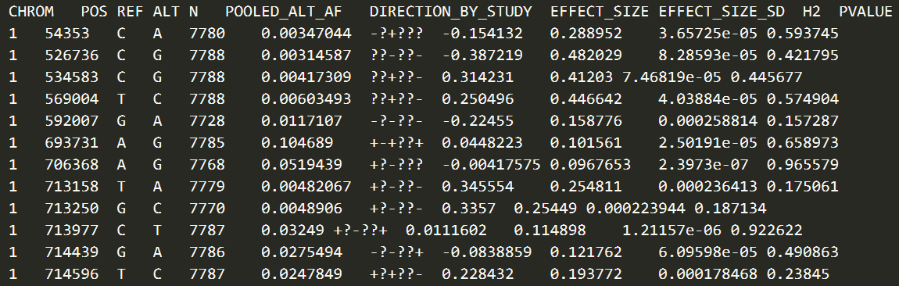
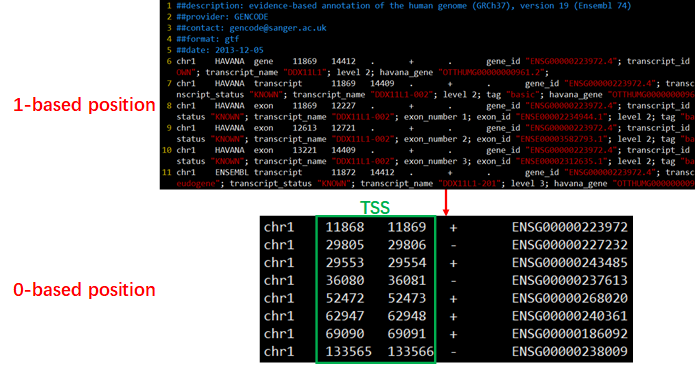
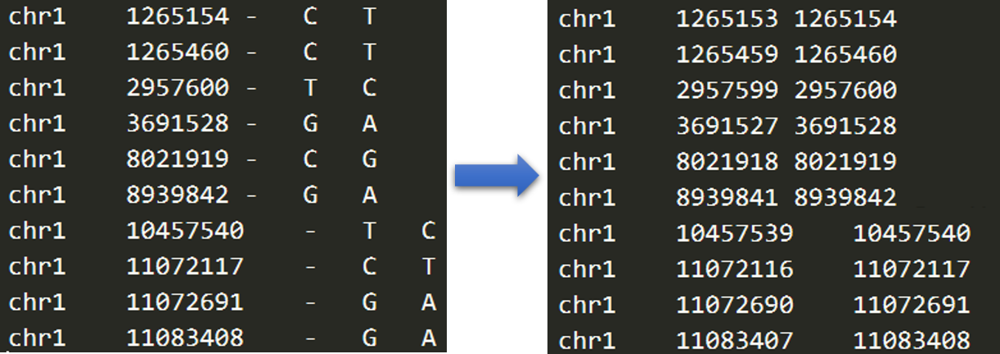
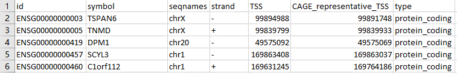
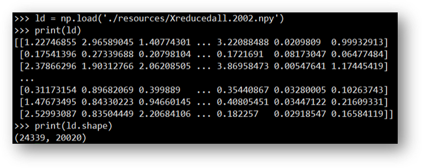
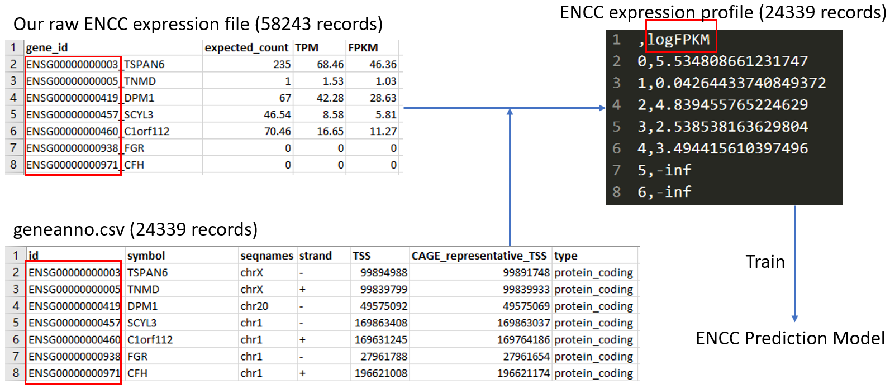

[TOC]

# ExPecto_Usage

Specification of how to use ExPecto to predict variant's effect on gene expression when applying to our own data

## Computes the chromatin effects of the variants, using trained convolutional neural network model
```
python chromatin.py ./example/example.vcf
```
The above command is provided by the author, but I recommend to use the following command.

```
python chromatin_print_modifiedByYong.py --cuda --gpu_num n ./example/example.vcf
```

Based on `chromatin.py` , I write `chromatin_print_modifiedByYong.py`. The main differences are that `chromatin_print_modifiedByYong.py` is allowed us to specify the GPU running the program by parameter `--gpu_num`, and prints some intermediate variables to help us monitor the procedure.

The input file `example.vcf` is the standard *vcf* format. The separator is the table sign. The screenshot is as following.


However, our variant file `variants_orig` does not have the same format, whose screenshot is as following.



We can use `filter_variants.py` to convert `variants_orig` into the file with standard format, meanwhile filtering variants based on `P-value`.

## Computes predicted tissue-specific expression effects which takes predicted chromatin effects as input
```
python predict.py --coorFile ./example/example.vcf --geneFile ./example/example.vcf.bed.sorted.bed.closestgene --snpEffectFilePattern ./example/example.vcf.shift_SHIFT.diff.h5 --modelList ./resources/modellist --output output.csv
```
`--closestGeneFile ./example/example.vcf.bed.sorted.bed.closestgene` specifies the gene association file which decides for each variant the associated gene for which the expression effect is predicted. The screenshot is as following.


The content of the gene association file has to include the following information:

- The first column is the chromosome name.
- The second and third columns are the positions. (Obviously, it is 0-based position.)
- The fourth and fifth columns are the reference bases and alternative bases, respectively.
- The last three columns are the strand of the associated gene, the ENSEMBL gene id (matched with the gene annotation file `./resources/geneanno.csv`) and distance to the representative TSS of that gene (The distance should be signed and calculated as ''*TSS position* - *variant position*" regardless of on which strand the gene is transcribed.).

### How to get the TSS information of the corresponding genes

Download the gene annotation file `gencode.v19.annotation.gtf.gz` from [GENCODE](https://www.gencodegenes.org/human/release_19.html).



As we can see, the initial `gtf` file adopts 1-based position. According to the specification, it should be converted to 0-based position when extract the TSS information. Therefore, I wrote a python script `gene_strand.py`.

The initial `gtf` file is specified by variable `gencode19`; the output file is specified by variable `gencode19_cut`. Please note that the separator is also the table sign.

Actually, there is no need to get  the gene annotation file from [GENCODE](https://www.gencodegenes.org/human/release_19.html), because we can only predict the expression of genes recorded in `resources/geneanno.csv` based on existent features.

### How to get the final gene expression file

The author mentioned that this can be done using closest-features from [BEDOPS](https://bedops.readthedocs.io/en/latest/) and the representation TSS of protein coding genes that they included, for example:

```
closest-features --delim '\t' --closest --dist <(awk '{printf $1"\t"$2-1"\t"$2"\n"}' ./example/example.vcf|sort-bed - ) ./resources/geneanno.pc.sorted.bed > ./example/example.vcf.bed.sorted.bed.closestgene
```

In practice, I find that this command does not work. I would advise to do as the following steps.

1. Run `preprocess_closest-features.py`  Input: the *vcf* variant file (1-based position); output: the variant file (0-based position).

   

2. Run `closest-features --delim '\t' --closest --dist variant_0based ./resources/geneanno.pc.sorted.bed > ./example/example.vcf.bed.sorted.bed.closestgene `

3. Run `preprocess_closest-features_addRefAlt.py`. Input: example.vcf.bed.sorted.bed.closestgene; output: example.vcf.bed.sorted.bed.closestgene_RefAlt

### How to train our own prediction model (e.g., ENCC)

```
python ./train.py --expFile ./resources/geneanno.exp.csv --targetIndex 1 --output model.adipose
```

This trains an ExPecto model using the Adipose gene expression profile in the first column of the `geneanno.exp.csv` file and the default precomputed epigenomic features. For training new ExPecto model for your custom (differential) expression profile, replace geneanno.exp.csv with your expression profile. The gene order has to be the same as the geneanno.csv. The generated model can be used by `predict.py` by adding the path of the xgboost model file to the `modelList` file.

In order to train own model, we are supposed to replace `geneanno.exp.csv` with our ENCC expression profile. 

- Requirement: the gene order has to be the same as the `geneanno.csv` (provided by the author) with 24339 records.



- Reason: need to read default precomputed epigenomic features stored in `Xreducedall.2002.npy` file
  (24339 rows, 20020 columns).



Then, I wrote a python script `prepareGeneannoExp.py` to get the final ENCC expression profile `geneanno.exp.csv`.

The input file is specified by variable `input_data`; the output is specified by variable `geneanno`.