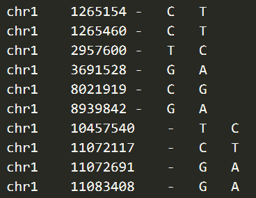
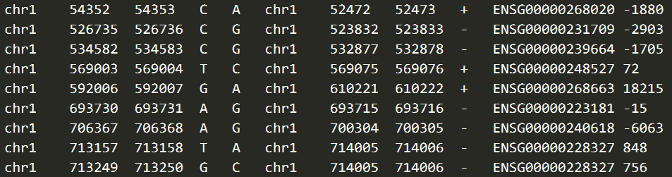

# ExPecto_Usage
Specification of how to use ExPecto to predict variant's effect on gene expression when applying to our own data
## Computes the chromatin effects of the variants, using trained convolutional neural network model
```
python chromatin.py ./example/example.vcf
```
The input file *example.vcf* is the standard vcf format. The seperator is the table sign. The screenshot is as following.



## Computes predicted tissue-specific expression effects which takes predicted chromatin effects as input
```
python predict.py --coorFile ./example/example.vcf --geneFile ./example/example.vcf.bed.sorted.bed.closestgene --snpEffectFilePattern ./example/example.vcf.shift_SHIFT.diff.h5 --modelList ./resources/modellist --output output.csv
```
`--closestGeneFile ./example/example.vcf.bed.sorted.bed.closestgene` specifies the gene association file which decides for each variant the associated gene for which the expression effect is predicted. The screenshot is as following.



The content of the gene association file has to include the following information:

- The first column is the chromosome name.
- The second and third columns are the positions. (Obviously, it is 0-based postion)

